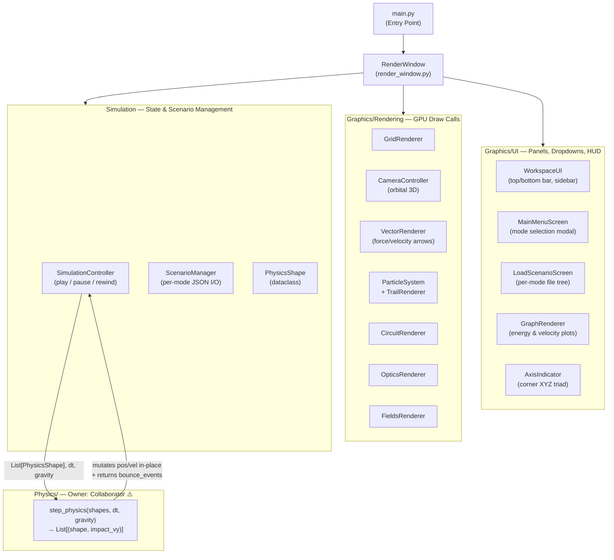
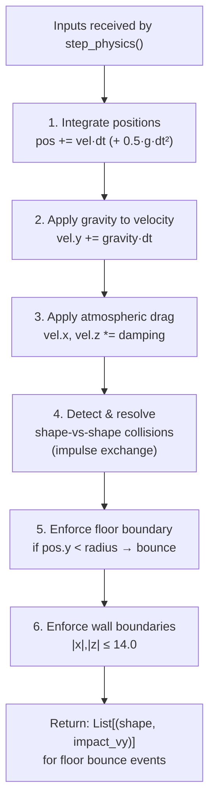
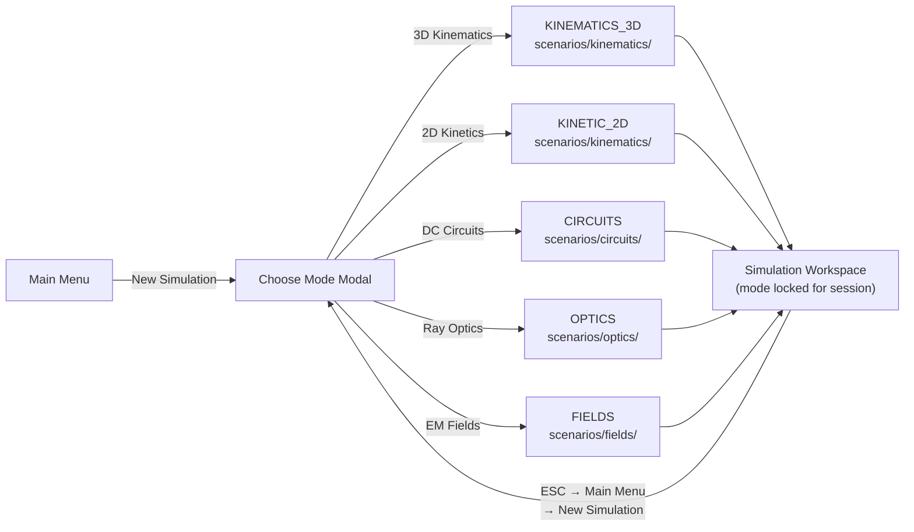
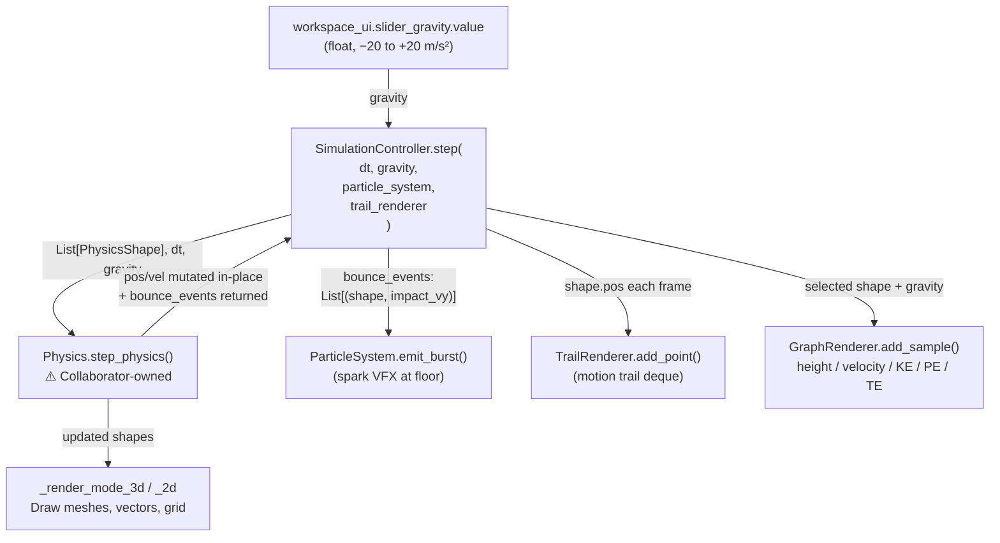
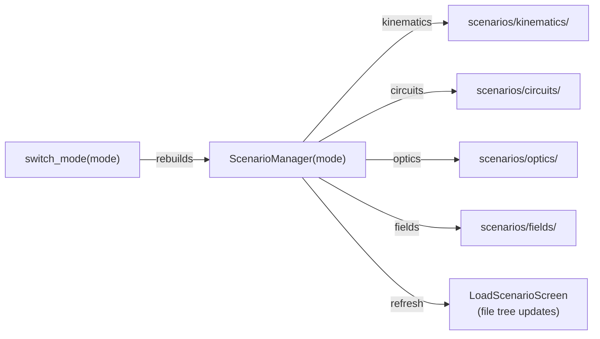
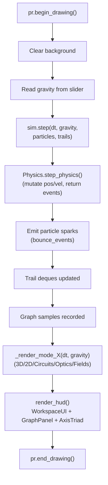

# Physics Simulator

[](https://github.com/geterktt)

**Goal:** An intuitive, visual platform for students and educators to explore core physics concepts through interactive multi-domain simulations. The UI and rendering layers are cleanly separated from the physics engine (developed in collaboration with [@geterktt](https://github.com/geterktt)), enabling safe, independent extension of each.

---

<details open>
<summary>📐 System Architecture</summary>

The project is divided into four distinct layers. Each has a single responsibility and communicates only through well-defined interfaces.



</details>

---

<details open>
<summary>⚠️ Physics Module Interface Contract</summary>

> This section is specifically for the **Physics module collaborator**.
> It defines exactly what the rest of the project sends in, reads back, and expects — nothing more is needed.

### Function Signature

```python
# Physics/__init__.py — the only public export
from Physics.engine import step_physics

def step_physics(
    shapes: List[PhysicsShape],   # All active rigid bodies this frame
    dt:     float,                # Frame delta time in seconds (e.g. 0.016)
    gravity: float                # Signed gravity scalar in m/s² (e.g. -9.81)
) -> List[Tuple[PhysicsShape, float]]:
    """
    Returns: list of (shape, impact_vy) for every shape
    that bounced off the floor this frame with |impact_vy| > 1.5.
    Used by the renderer to trigger particle spark bursts.
    """
```

### `PhysicsShape` — What the Physics Module Receives

Each element in `shapes` is a `PhysicsShape` dataclass (defined in `Simulation/sim_shapes.py`).
The physics module **reads** these fields and **mutates `pos` and `vel` in-place**:

```
PhysicsShape
├── shape_id    : str         — unique ID (read-only, do not modify)
├── shape_type  : str         — "sphere" or "cube" (read-only)
│
├── pos         : Vector3     ← READ & WRITE  (x, y, z world position)
├── vel         : Vector3     ← READ & WRITE  (x, y, z velocity m/s)
│
├── radius      : float       ← READ ONLY     (sphere radius / AABB bounding)
├── size        : Vector3     ← READ ONLY     (w, h, d for cubes)
├── mass        : float       ← READ ONLY     (kg)
├── restitution : float       ← READ ONLY     (0.0–1.0 bounce coefficient)
│
├── color       : Color       — renderer-only, ignore
└── shape_id    : str         — renderer-only, ignore
```

### What the Physics Module Must Do Each Frame



### Return Value Used By Renderer

```python
bounce_events = step_physics(shapes, dt, gravity)

# Renderer uses it like this:
for shape, impact_vy in bounce_events:
    spark_pos = Vector3(shape.pos.x, 0.0, shape.pos.z)
    spark_vel = Vector3(shape.vel.x * 0.4, abs(impact_vy) * 0.5, shape.vel.z * 0.4)
    particle_system.emit_burst(spark_pos, count=14, base_vel=spark_vel)
```

### Coordinate System & Units

```
         +Y  (up)
          │
          │
    ──────┼────── +X  (right)
         /│
        / │
      +Z  │   (toward viewer)

Floor:  y = 0.0
Walls:  |x| ≤ 14.0,  |z| ≤ 14.0
Units:  metres, seconds, kg
Gravity: typically −9.81 (downward), user-adjustable at runtime
```

</details>

---

<details>
<summary>🔀 Simulation Mode Flow</summary>

Mode is **chosen once** at launch via the main menu modal. Mid-simulation mode switching is intentionally disabled — each domain has its own scenario directory.



> **Note:** 3D Kinematics and 2D Kinetics share the same `kinematics/` directory because both use identical `PhysicsShape` JSON format.

</details>

---

<details>
<summary>📊 Per-Frame Variable Flow</summary>

This diagram shows how a user's gravity slider value travels through every subsystem each frame.



</details>

---

<details>
<summary>💾 Per-Mode Scenario Directories</summary>

`ScenarioManager` is rebuilt whenever `switch_mode()` is called and auto-migrates any legacy root-level `.json` files into `kinematics/`.

```
Simulation/scenarios/
├── kinematics/      ← 3D Kinematics + 2D Kinetics  (PhysicsShape JSON)
│   ├── Single Sphere.json
│   ├── Double Cascade.json
│   └── Cube & Sphere.json
├── circuits/        ← DC Circuits   (procedural, no JSON presets yet)
├── optics/          ← Ray Optics    (procedural, no JSON presets yet)
└── fields/          ← EM Fields     (procedural, no JSON presets yet)
```



</details>

---

<details>
<summary>⏱️ Frame Lifecycle (Simulation Mode)</summary>



</details>

---

<details>
<summary>🗂️ Full Project Structure</summary>

```
Physics-Simulator/
├── Physics/                        # Core deterministic physics (owned by collaborator @geterktt ⚠️)
│   ├── __init__.py                 # Exports: step_physics(shapes, dt, gravity)
│   └── engine.py                   # Velocity Verlet, collision, boundary enforcement
│
├── Graphics/
│   ├── Rendering/
│   │   ├── render_window.py        # Main loop, screen routing, mode dispatch
│   │   ├── render_camera.py        # Orbital 3D camera (yaw/pitch/zoom)
│   │   ├── render_grid.py          # 3D GPU grid + 2D Cartesian grid
│   │   ├── render_vectors.py       # 3D/2D velocity & force arrow renderer
│   │   ├── render_particles.py     # Collision spark bursts + motion trails (deque)
│   │   ├── render_circuits.py      # DC circuit canvas + animated electron flow
│   │   ├── render_optics.py        # Ray optics: lasers, mirrors, lenses
│   │   ├── render_fields.py        # EM vector field grid + charge/magnet sources
│   │   └── render_colors.py        # Shared color palette constants
│   │
│   └── UI/
│       ├── ui_workspace.py         # Top bar (File▼ View▼), sidebar, inspector
│       ├── ui_menu.py              # Main menu + mode selection modal
│       ├── ui_settings.py          # Settings screen (resolution, sidebar position)
│       ├── ui_load_scenario.py     # Per-mode file tree: load/save/rename/delete
│       ├── ui_graph.py             # Real-time energy/velocity plot (deque-backed)
│       ├── ui_axis_indicator.py    # Corner XYZ triad (show toggled by View▼)
│       └── ui_elements.py          # Button, Slider, Toggle, NodeSelector, FileTreeSelector
│
├── Simulation/
│   ├── sim_controller.py           # Play/pause/rewind + frame history (deque maxlen=600)
│   ├── sim_scenarios.py            # Per-mode ScenarioManager, JSON I/O, auto-migration
│   ├── sim_shapes.py               # PhysicsShape dataclass (the Physics interface type)
│   ├── sim_modes.py                # SimulationMode enum
│   ├── sim_circuits.py             # CircuitNode/Component + nodal relaxation solver
│   ├── sim_optics.py               # Mirror/lens/emitter model + ray tracer
│   └── sim_fields.py               # Charge/magnet model + Coulomb/dipole calculator
│
├── .github/workflows/
│   └── unit_tests.yml              # CI: "Unit Tests" (manual dispatch + push trigger)
│
├── main.py                         # Application entry point
├── requirements.txt
└── README.md
```

</details>

---

## 🚀 Getting Started

### Prerequisites
- Python **3.10+**
- `pyray` (Raylib Python bindings) — see `requirements.txt`

### Installation

```bash
git clone <your-repository-url>
cd Physics-Simulator
python -m venv .venv
```

**Activate:**
```powershell
# Windows
.venv\Scripts\activate
```
```bash
# macOS / Linux
source .venv/bin/activate
```
```bash
pip install -r requirements.txt
```

### Run

```bash
python main.py
```

---

## 🎮 Usage

1. **Launch** → Main Menu appears
2. **New Simulation** → choose a domain from the modal (mode is locked for the session)
3. **Load Scenario** → browse the per-mode file tree (`File ▼ → Load Scenario`)
4. **File ▼ / View ▼** → save, main menu, toggle grid/axis, settings
5. **To switch domains** → `File ▼ → Main Menu` → New Simulation → choose another mode

**Keyboard shortcuts (Simulation screen):**

| Key | Action |
|-----|--------|
| `Space` / `P` | Play / Pause |
| `S` | Stop & Reset |
| `←` (hold) | Rewind |
| `G` | Toggle grid |
| `V` | Toggle velocity arrows |
| `T` | Toggle motion trails |
| `1–4` | Camera preset views (3D mode) |
| `ESC` | Deselect / Back to menu |

---

## 🔮 Future Roadmap

- [ ] JSON save/load support for Circuit, Optics, and Fields scenes
- [ ] Verlet integration improvements (substeps for high-speed objects)
- [ ] Additional collision shapes (circles, AABBs, convex polygons)
- [ ] Wave optics mode (Huygens principle visualization)
- [ ] Magnetic force on moving charges in EM Fields mode
- [ ] Export bindings for external engines (e.g., Godot)

---

## 🤝 Team

| Area | Owner |
|------|-------|
| `Physics/` — `step_physics()`, integration, collision | **Collaborator ([@geterktt](https://github.com/geterktt))** |
| `Graphics/`, `Simulation/`, CI, documentation | **Project author** |

---

*Documentation updated 2026-06-28.*
