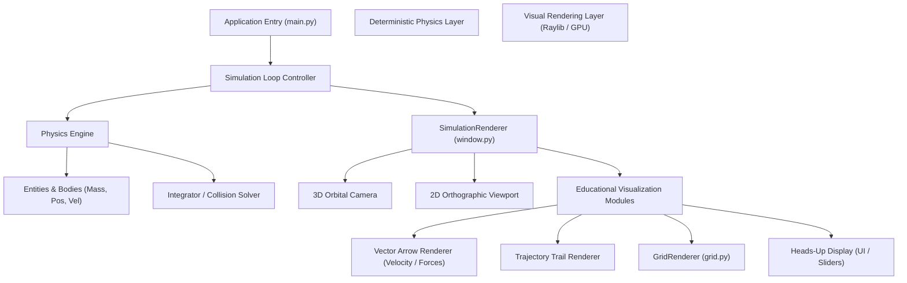

# Educational Physics Simulator

This project is an educational physics engine and simulation environment built from scratch in Python. It is designed to help students, educators, and developers visualize, interact with, and learn about core physics and mathematics concepts.

One of the project's foundational design goals is a strict separation of concerns between physics computation and visual presentation. This modularity allows the core physics module to remain lightweight, clean, and easily portable to different rendering frameworks or game engines in the future.

---

## 🚀 Key Features

* **Strict Separation of Concerns**: The core physics equations and rendering pipelines are completely decoupled.
* **Vector Mathematics**: Powered by **NumPy** for fast, clean, and readable vector and matrix operations.
* **Pygame Visualizer**: A lightweight, responsive rendering loop in **Pygame** to observe simulations in real-time.
* **Educational Codebase**: Built with readability in mind—ideal for learning collision response, forces, friction, and integration algorithms.

---

## 🛠️ Architecture & Visual Pipelines

The codebase is organized into decoupled layers, utilizing **Raylib (`pyray`)** for hardware-accelerated 3D/2D educational rendering and deterministic physics calculations.

### 📊 Interactive Flow diagrams
Click any of the individual diagram guides below for detailed educational breakdowns:
1. **[System Architecture Documentation](docs/diagrams/1_SYSTEM_ARCHITECTURE.md)**
2. **[Fixed Timestep Simulation Loop](docs/diagrams/2_FIXED_TIMESTEP_LOOP.md)**
3. **[Coordinate Scaling & Transformation](docs/diagrams/3_COORDINATE_TRANSFORMATION.md)**
4. **[Interactive User Manipulation & Picking](docs/diagrams/4_INTERACTIVE_INPUT_PIPELINE.md)**

#### Live System Architecture Overview


```
Physics-Simulator/
├── Physics/              # Core physics computations (no graphics dependencies)
├── Rendering/            # Raylib 3D/2D GPU Visualization & display loops
│   ├── window.py         # SimulationRenderer & camera management
│   ├── grid.py           # Coordinate grid & axis visualization
│   └── colors.py         # Curated educational UI color palette
├── docs/diagrams/        # Detailed educational architecture flowcharts
├── README.md             # Project documentation (this file)
└── main.py               # Main orchestrator & entry point
```

---

## 💻 Getting Started

### Prerequisites
* **Python 3.8** or newer is recommended.

### Installation

1. **Clone the Repository**
   ```bash
   git clone <your-repository-url>
   cd Physics-Simulator
   ```

2. **Create and Activate a Virtual Environment**
   * **Windows**:
     ```powershell
     python -m venv .venv
     .venv\Scripts\activate
     ```
   * **macOS / Linux**:
     ```bash
     python3 -m venv .venv
     source .venv/bin/activate
     ```

3. **Install Dependencies**
   ```bash
   pip install -r requirements.txt
   ```

### Running the Simulator

To run the simulator and launch the interactive Pygame window:
```bash
python main.py
```

---

## 🔮 Future Roadmap

* [ ] Implement Verlet Integration for enhanced numerical stability.
* [ ] Support standard collision shapes (circles, axis-aligned bounding boxes, custom polygons).
* [ ] Create export wrappers or bindings to allow the `Physics` engine to drive entities in external engines (e.g., Godot).
* [ ] Interactive GUI overlay to tune gravity, drag, mass, and elasticity dynamically.
