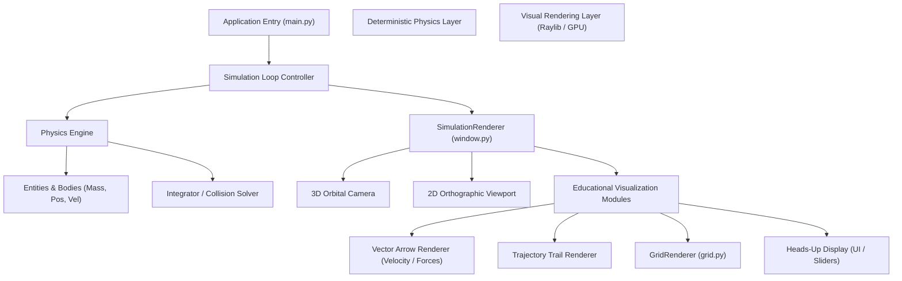
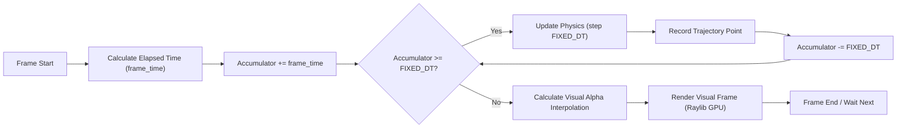
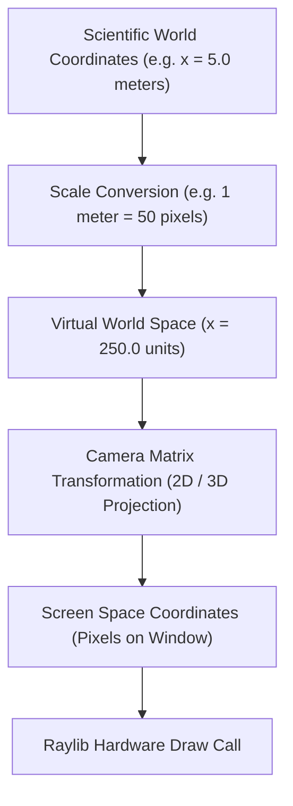
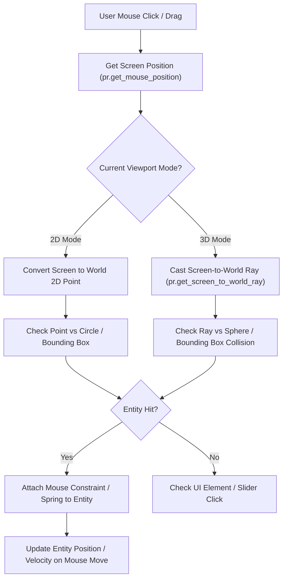

# Educational Visual Simulation Architecture

This document outlines the architecture, main loops, coordinate transformations, and interaction workflows for building visual, educational physics programs with Raylib and Python. 

When uploaded to GitHub, these Mermaid diagrams will render automatically as live interactive diagrams.

---

## 1. System Architecture

Shows the clean separation between the deterministic math engine (`PhysicsEngine`) and the Raylib visual rendering pipeline (`SimulationRenderer`).

---

## 2. Fixed Timestep Simulation Loop

To ensure scientific accuracy and repeatable educational results regardless of monitor refresh rates (60Hz vs 144Hz), the physics updates run at a constant fixed time step (`FIXED_DT`), decoupled from visual rendering.

---

## 3. Coordinate Scaling & Transformation Pipeline

Educational programs must bridge the gap between SI units (meters, seconds, kilograms) and monitor screen spaces (pixels).

---

## 4. Interactive User Manipulation & Mouse Picking Pipeline

Enabling tactile interactivity (grabbing a ball, dragging vectors, tweaking sliders) follows this input pipeline:

