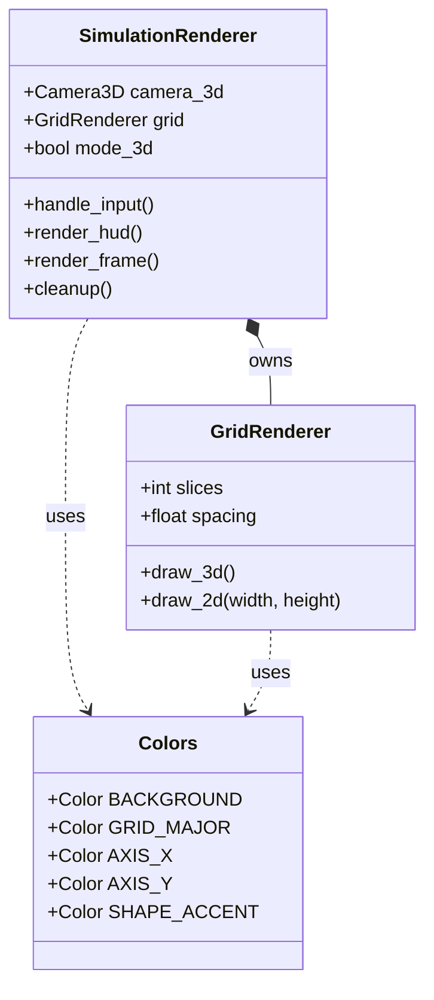

# Raylib GPU Rendering Pipeline Architecture

> **Module Documentation:** `Rendering.renderer` & `main.py`  
> **Target Library:** `pyray` (Raylib Python 6.0.1)  
> **Fulfills Tickets:** `PHY-17`, `PHY-18`, `PHY-20`, `PHY-24`

---

## 1. Executive Summary

The Antigravity Rendering Engine utilizes **Raylib (`pyray`)** to achieve direct GPU OpenGL hardware-accelerated rendering. It natively supports instant runtime switching between **3D Orbital Perspective** and **2D Orthographic Cartesian** coordinate spaces.

---

## 2. Component Architecture



---

## 3. Class Specifications

### `SimulationRenderer` (`PHY-18`, `PHY-17`)
Master controller for OpenGL hardware window context creation and frame dispatch.
* **Hardware MSAA 4X:** Anti-aliasing enabled natively via `FLAG_MSAA_4X_HINT` for crisp vector edges.
* **Hybrid Viewport Switching:** Pressing <kbd>M</kbd> dynamically toggles `self.mode_3d`, switching OpenGL draw calls between 3D camera projection matrices (`begin_mode_3d`) and 2D orthographic canvas drawing.

### `GridRenderer` (`PHY-24`)
Manages dual-mode coordinate grids.
* **3D Mode:** Executes hardware GPU `pr.draw_grid()` along the XZ floor plane.
* **2D Mode:** Calculates dynamic Cartesian line spacing relative to current resolution bounds.

### `Colors` (`PHY-20`)
Hardware RGBA `pr.Color()` struct container.

---

## 4. Controls & Verification

To test the engine locally:
```bash
python main.py
```
* **[M]** : Toggle instantly between 3D Perspective and 2D Cartesian modes.
* **[G]** : Show/Hide coordinate grid.
* **[ESC]** : Cleanly terminate OpenGL context.
