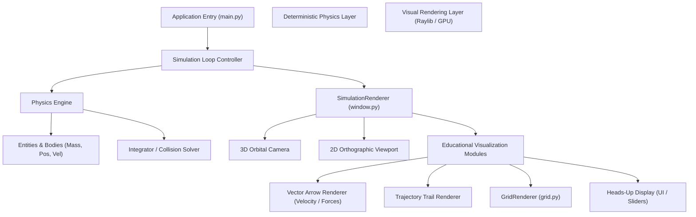

# 1. System Architecture

This diagram shows the clean separation between the deterministic math engine (`PhysicsEngine`) and the Raylib visual rendering pipeline (`SimulationRenderer`) for educational physics software.

