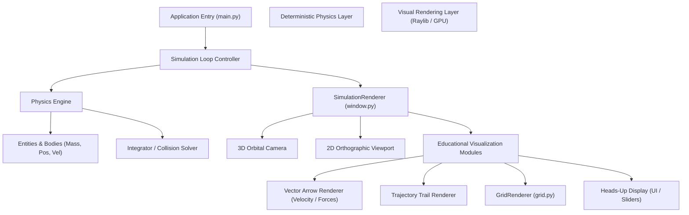

# 1. System Architecture

This diagram shows the clean separation between the deterministic math engine (`PhysicsEngine`) and the Raylib visual rendering pipeline (`SimulationRenderer`) for educational physics software.

---

## 📋 Future Implementation Plan

### Core Architecture & Separation of Concerns
* [x] **Decoupled Folder Structure**: Group all presentation logic under `Graphics/` containing `Rendering/` (hardware viewport) and `UI/` (interactive widgets).
* [ ] **Physics Engine API**: Create `Physics/engine.py` exposing a stateless step method `step(dt: float, bodies: list)` to keep physics math 100% portable.

### Educational Visualization Subsystems
* [ ] **Vector Arrow Renderer (`Graphics/Rendering/vectors.py`)**:
  * Implement `draw_force_vector(body, force_type)` rendering directional 2D triangles / 3D cylinders representing velocity, gravity, and normal forces.
  * Add color coding (e.g., Red = Velocity, Blue = Gravity, Green = Normal Force).
* [ ] **Trajectory Trail Renderer (`Graphics/Rendering/trails.py`)**:
  * Maintain a ring buffer of past positions for each physics body.
  * Draw fading line strips (`pr.draw_line_strip`) to visualize orbits and parabolas.
