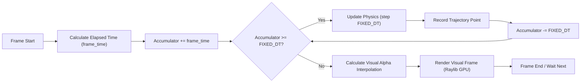

# 2. Fixed Timestep Simulation Loop

To ensure scientific accuracy and repeatable educational results regardless of monitor refresh rates (60Hz vs 144Hz), the physics updates run at a constant fixed time step (`FIXED_DT`), decoupled from visual rendering.

