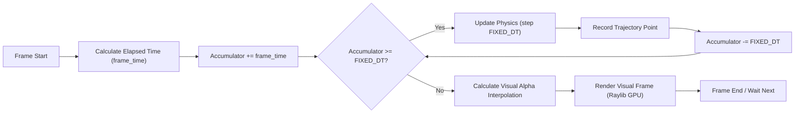

# 2. Fixed Timestep Simulation Loop

To ensure scientific accuracy and repeatable educational results regardless of monitor refresh rates (60Hz vs 144Hz), the physics updates run at a constant fixed time step (`FIXED_DT`), decoupled from visual rendering.



---

## 📋 Future Implementation Plan

### Deterministic Physics Core
* [ ] **Rigid Body State Definition (`Physics/body.py`)**: Define `RigidBody` storing `mass`, `position`, `velocity`, `acceleration`, and `restitution` (elasticity).
* [ ] **Fixed Timestep Accumulator**: In `SimulationRenderer`, track time accumulator:
  ```python
  FIXED_DT = 1.0 / 60.0
  self.accumulator += pr.get_frame_time()
  while self.accumulator >= FIXED_DT:
      physics_engine.step(FIXED_DT)
      self.accumulator -= FIXED_DT
  ```
* [ ] **Numerical Integration Solvers**: Implement Semi-Implicit Euler for stable projectile collisions, with an upgrade path to Verlet integration for smooth orbital mechanics.
