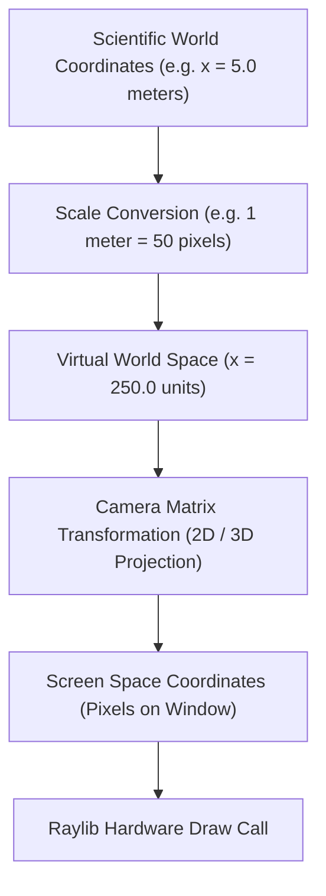

# 3. Coordinate Scaling & Transformation Pipeline

Educational programs must bridge the gap between SI units (meters, seconds, kilograms) and monitor screen spaces (pixels).

```mermaid
flowchart TD
    SI["Scientific World Coordinates (e.g. x = 5.0 meters)"] 
    --> Scale["Scale Conversion (e.g. 1 meter = 50 pixels)"]
    
    Scale --> WorldSpace["Virtual World Space (x = 250.0 units)"]
    
    WorldSpace --> CamTransform["Camera Matrix Transformation (2D / 3D Projection)"]
    CamTransform --> ScreenSpace["Screen Space Coordinates (Pixels on Window)"]
    ScreenSpace --> DrawCall["Raylib Hardware Draw Call"]
```
