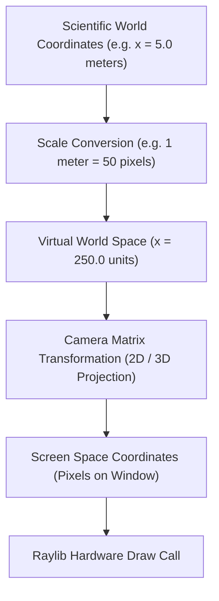

# 3. Coordinate Scaling & Transformation Pipeline

Educational programs must bridge the gap between SI units (meters, seconds, kilograms) and monitor screen spaces (pixels).

---

## 📋 Future Implementation Plan

### Scientific Scaling System
* [ ] **Coordinate Scaling Manager (`Graphics/Rendering/scale.py`)**: Define standard pixels-per-meter constants (e.g. `PPM = 50.0`), allowing physics formulas to compute in exact meters while expanding visually across any monitor resolution.
* [ ] **Bidirectional Transformers**: Implement `world_to_screen(vec_meters)` and `screen_to_world(vec_pixels)` helper utilities.
* [ ] **Dynamic Viewport Zoom & Pan**: Connect mouse scroll wheel input to adjust `PPM` scale dynamically while maintaining grid line spacing ratios.
