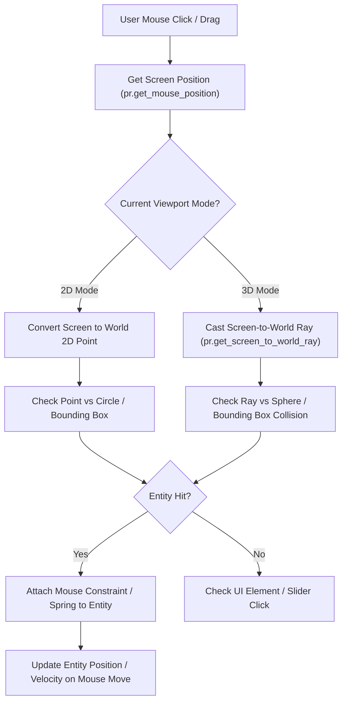

# 4. Interactive User Manipulation & Mouse Picking Pipeline

Enabling tactile interactivity (grabbing a ball, dragging vectors, tweaking sliders) follows this input pipeline:

---

## 📋 Future Implementation Plan

### Interactive Entity Manipulation
* [ ] **2D Mouse Picking**: Use `pr.check_collision_point_circle` to allow students to click and grab physics spheres directly on screen.
* [ ] **3D Raycasting**: Implement `pr.get_screen_to_world_ray(pr.get_mouse_position(), camera)` to pick 3D entities in orbital view.
* [ ] **Mouse Spring Constraints**: Attach a damped spring between the cursor and selected rigid body so pulling objects creates realistic force momentum.

### UI Widget Expansion (`Graphics/UI/elements.py`)
* [x] **Foundational Controls**: Implement `Panel`, `Slider`, `Toggle`, and `Button` base classes.
* [ ] **Additional Parameter Sliders**: Add live sliders for *Mass ($kg$)*, *Friction Coefficient*, and *Restitution (Elasticity)*.
* [ ] **Simulation State Buttons**: Add dedicated Play, Pause, and Step-Forward buttons for detailed educational analysis.
